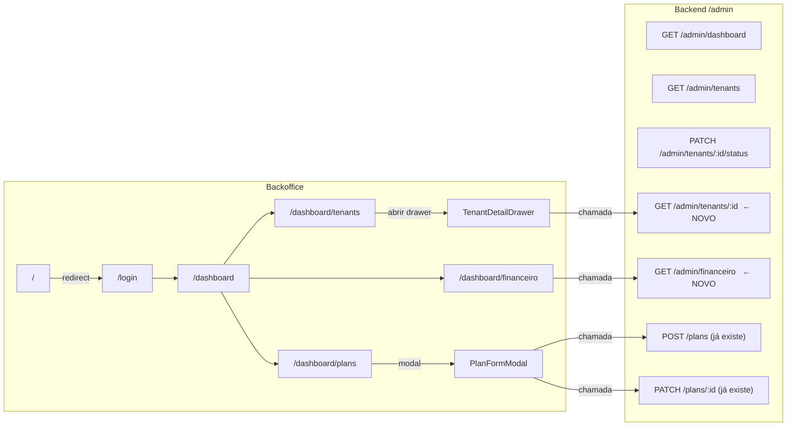

# Plano de ação — Backoffice completo

## Estado atual vs o que falta

```
Existente                          Falta
─────────────────────────────────────────────────────────────────
Dashboard (KPIs globais)           Dashboard sem série temporal
Tenants — lista + troca de status  Tenant — drawer/detail (assinaturas, agendamentos, receita)
Planos — só tabela read-only       Planos — modal criar/editar (backend já existe)
Financeiro — copia KPIs            Financeiro — dados reais por período e por tenant
/ raiz — template Next             / raiz — redirect para /login ou /dashboard
```

## Diagrama do fluxo novo



## Tarefas

### 1. Raiz — redirect simples
- **Arquivo:** [`apps/backoffice/app/page.tsx`](apps/backoffice/app/page.tsx)
- Substituir o template Next por `redirect("/dashboard")` (Next `redirect()` do `next/navigation`).

### 2. Planos — modal criar/editar
- **Arquivo:** [`apps/backoffice/app/dashboard/plans/page.tsx`](apps/backoffice/app/dashboard/plans/page.tsx)
- Adicionar `PlanFormModal` (Dialog + formulário) com campos: `name`, `description`, `monthlyPrice`, `transactionFee`, `maxServices`, `active`.
- `POST /plans` ao criar, `PATCH /plans/:id` ao editar — ambos já existem e exigem `ADMIN`.
- Botão "Novo Plano" e ícone de lápis abrem o modal, ambos sem nova mutação de backend.

### 3. Tenant — drawer de detalhe
- **Novo endpoint:** `GET /admin/tenants/:id` em [`backend/src/admin/admin.controller.ts`](backend/src/admin/admin.controller.ts) e [`backend/src/admin/admin.service.ts`](backend/src/admin/admin.service.ts).
  - Retorna: dados do tenant, últimos 20 agendamentos (`startTime desc`), assinaturas de fidelidade ativas (`loyaltySubscriptions` com `plan`), total de receita (`appointments` online confirmados/concluídos).
- **Componente:** `TenantDetailDrawer` (Sheet/Drawer) no arquivo da página de tenants.
  - Seções: Info (slug, plano, status, Stripe onboarding), Receita total, Últimos agendamentos, Assinaturas de fidelidade ativas.
- Botão "Ver detalhes" no `DropdownMenu` de cada linha da tabela.

### 4. Financeiro — dados reais por período
- **Novo endpoint:** `GET /admin/financeiro?dateFrom=&dateTo=` em `AdminController`/`AdminService`.
  - Retorna: lista de tenants com `{ tenantId, name, slug, onlineRevenue, manualRevenue, fees, totalAppointments }` no período.
  - Usa a mesma lógica de `startOfLocalCalendarDay`/`endOfLocalCalendarDay` do helper já criado em [`backend/src/common/calendar-date.ts`](backend/src/common/calendar-date.ts).
- **Arquivo:** [`apps/backoffice/app/dashboard/financeiro/page.tsx`](apps/backoffice/app/dashboard/financeiro/page.tsx)
  - Substituir os placeholders "Gráfico em processamento…" por: seletor de período (mês/ano), tabela por tenant com receita e fees, e totais agregados.
  - Remover dependência de `GET /admin/dashboard` desta página (já está no dashboard).

## Ordem sugerida de execução
1. Redirect raiz (2 min, trivial)
2. Modal de planos (back já pronto, só front)
3. Drawer de detalhe de tenant (1 endpoint novo + componente)
4. Financeiro com dados reais (1 endpoint novo + refatorar página)
