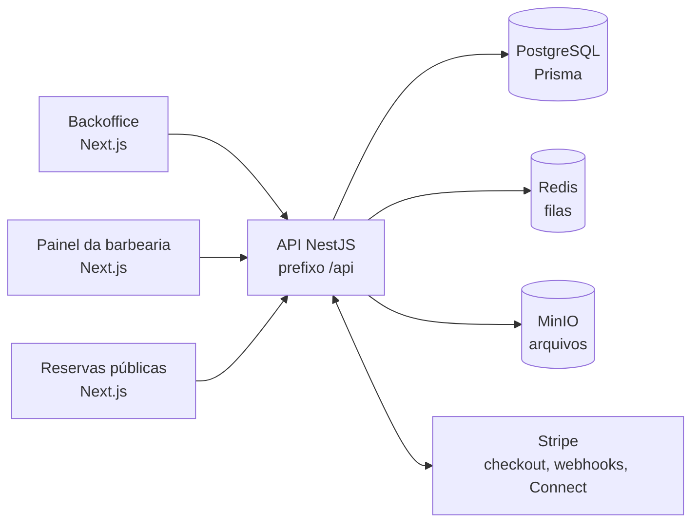

# Barbearia SaaS

[](https://github.com/heitordlq/barber-shop-app/actions/workflows/ci.yml)


Plataforma multi-tenant para barbearias: agendamento com barbeiros e horários próprios, fidelidade, pagamentos (Stripe Connect), painel do dono da barbearia, app público de reservas e backoffice do SaaS.

## Arquitetura



Monorepo com **pnpm** workspaces e **Turborepo**:

| Pasta | Descrição |
|--------|-----------|
| `backend/` | API **NestJS** + **Prisma** + PostgreSQL, Redis (filas), MinIO (objetos). Prefixo global: `/api`. |
| `apps/backoffice/` | **Next.js** — operação do SaaS (admin): tenants, planos, financeiro. |
| `apps/barbershop/` | **Next.js** — painel da barbearia (BarberDash): agenda, clientes, serviços, fidelidade, equipe e horários por barbeiro, financeiro, configurações, fechamento temporário. |
| `apps/client/` | **Next.js** — site público de agendamento por slug da barbearia, escolha de barbeiro, pagamento e fidelidade. |
| `packages/` | Código compartilhado (quando existir). |

## Funcionalidades (visão geral)

- **Multi-tenant**: cada barbearia é um tenant; registro público cria dono (**OWNER**) e tenant.
- **Agenda**: slots respeitam horários da unidade e, quando configurado, **horários por barbeiro**; bloqueios e pausas.
- **Equipe**: dono cadastra barbeiros, define horários de trabalho e permissões de acesso ao painel.
- **Serviços e clientes**: CRUD no painel da barbearia; clientes finais no fluxo público.
- **Fidelidade**: planos e assinaturas/cartões conforme regras do backend.
- **Pagamentos**: Stripe (checkout, webhooks); repasse com **Stripe Connect** onde aplicável.
- **Backoffice SaaS**: visão de barbearias, planos da plataforma e financeiro agregado.
- **Infra local**: Docker Compose com PostgreSQL, Redis e MinIO.

## Pré-requisitos

1. [Node.js 22+](https://nodejs.org/) (recomendado alinhar à versão do projeto).
2. [pnpm](https://pnpm.io/installation) — na raiz está fixado `packageManager: pnpm@10.33.0` (use `corepack enable` se quiser alinhar à versão exata).
3. [Docker Desktop](https://www.docker.com/products/docker-desktop/) (ou Docker Engine + Compose) para Postgres, Redis e MinIO.
4. Contas opcionais para fluxos completos: [Stripe](https://stripe.com) (teste) e [Resend](https://resend.com) (e-mail transacional).

## Instalação das dependências

Na **raiz** do repositório:

```bash
pnpm install
```

Isso instala dependências de todos os pacotes e apps (workspace).

## Configuração de ambiente

1. **Backend (obrigatório para API e Prisma)**  
   Copie o exemplo e ajuste chaves reais quando for integrar Stripe/Resend:

   ```bash
   copy backend\.env.example backend\.env
   ```

   No Linux/macOS:

   ```bash
   cp backend/.env.example backend/.env
   ```

   O ficheiro inclui `DATABASE_URL` compatível com o Postgres do `docker-compose.yml` em `localhost`.

2. **Raiz (opcional)**  
   Se usar variáveis partilhadas por scripts ou Compose na raiz:

   ```bash
   copy .env.example .env
   ```

   As apps Next.js usam por defeito `NEXT_PUBLIC_API_URL=http://localhost:3001/api` se não definir nada.

## Base de dados e seed (utilizador admin do backoffice)

1. Subir infraestrutura:

   ```bash
   docker compose up postgres redis minio -d
   ```

2. Migrações (a partir da pasta do backend):

   ```bash
   cd backend
   pnpm exec prisma migrate dev
   cd ..
   ```

3. **Criar o utilizador ADMIN** (apenas se ainda não existir `admin@barbearia.app`):

   ```bash
   pnpm --filter backend db:seed
   ```

### Credenciais do backoffice (após o seed)

O e-mail do admin é `admin@barbearia.app`. **Não existe senha padrão**: defina `ADMIN_SEED_PASSWORD` no `backend/.env` antes de correr o seed. Se não definir, o seed gera uma senha aleatória e mostra-a **uma única vez** no terminal. Se o utilizador já existir, o seed **não altera** a palavra-passe.

> O login do backoffice exige role **ADMIN**. O registo público da API cria **OWNER** (dono de barbearia), não admin do SaaS.

## Correr tudo em desenvolvimento

Na **raiz**:

```bash
pnpm run dev
```

O Turborepo arranca em paralelo o backend e os três frontends.

### URLs locais

| Serviço | URL |
|---------|-----|
| API | http://localhost:3001 |
| API (prefixo) | http://localhost:3001/api |
| Backoffice | http://localhost:3002 |
| BarberDash (barbearia) | http://localhost:3003 |
| App cliente (agendamento público) | http://localhost:3004 |

### Postgres (Compose)

- **Utilizador:** `barbearia`  
- **Palavra-passe:** `barbearia123`  
- **Base de dados:** `barbearia`  
- **Porta:** `5432`

### MinIO (consola S3 local)

- API: porta **9000**  
- Consola Web: **9001** (credenciais no `docker-compose.yml` e no `backend/.env.example`)

## Scripts úteis na raiz

| Comando | Descrição |
|---------|-----------|
| `pnpm run dev` | Desenvolvimento (turbo). |
| `pnpm run build` | Build de todos os pacotes configurados no pipeline. |
| `pnpm run lint` | Lint. |
| `pnpm run db:generate` | `prisma generate` no backend (via turbo). |
| `pnpm run db:migrate` | `prisma migrate dev` no backend (via turbo). |
| `pnpm run db:studio` | Prisma Studio no backend. |
| `pnpm --filter backend db:seed` | Seed do utilizador admin. |

## Webhooks Stripe (local)

1. Instale a [Stripe CLI](https://stripe.com/docs/stripe-cli).
2. `stripe login`
3. Encaminhe eventos para o backend:

   ```bash
   stripe listen --forward-to localhost:3001/api/payments/webhook
   ```

4. Copie o segredo `whsec_...` para `STRIPE_WEBHOOK_SECRET` no `backend/.env`.

## Docker Compose (stack completa)

Para subir API + frontends já empacotados (modo produção no Compose):

```bash
docker compose up --build -d
```

As portas expostas mantêm-se alinhadas com a tabela acima (atenção: nos serviços `backoffice` / `barbershop` / `client` o mapeamento pode ser `3002:3000`, etc., conforme o `docker-compose.yml`).

## Resolução rápida de problemas

- **Erro de ligação à base de dados:** confirme que o Postgres do Compose está saudável e que `DATABASE_URL` no `backend/.env` usa `localhost` quando corre a API na máquina anfitriã.
- **CORS / login:** o backend usa `BACKOFFICE_URL`, `BARBERSHOP_URL` e `CLIENT_URL`; os valores por defeito apontam para as portas 3002–3004.
- **Sem utilizador admin:** execute `pnpm --filter backend db:seed` após as migrações.
